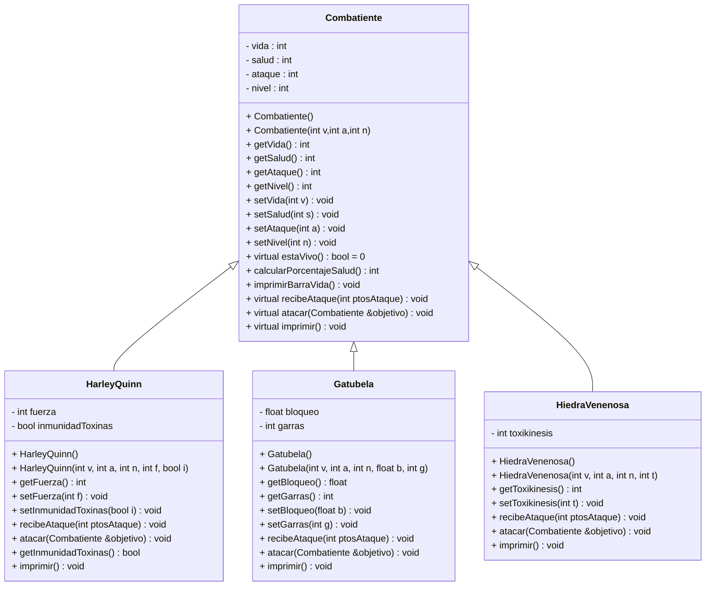
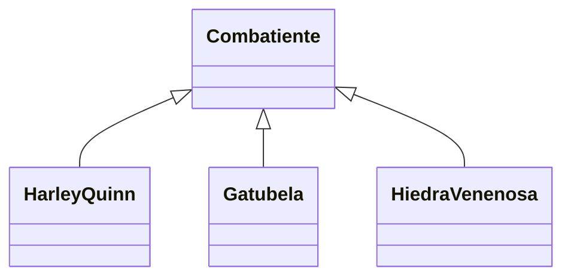

### Este proyecto fue realizado por:
Tania Sofia Arrazola Bello A01738124 

# UML CLASE COMBATIENTE


# Documentación del Proyecto
## Introducción y descripción 
En este proyecto, desarrollamos una simulación de combate utilizando un conjunto de clases que representan diferentes tipos de combatientes. El objetivo del proyecto es crear una simulación en la que dos ejércitos de combatientes se enfrenten entre sí, con cada combatiente teniendo características y habilidades únicas. El sistema permite la creación dinámica de combatientes a partir de archivos de texto, la ejecución de combates entre ellos y la impresión de resultados.

## Uso de Conceptos de Programación

## Herencia

La herencia se utilizó para definir una jerarquía de clases que representan diferentes tipos de combatientes. La clase base `Combatiente` proporciona una interfaz común y atributos compartidos, mientras que las clases derivadas `HarleyQuinn`, `Gatubela`, y `HiedraVenenosa` extienden esta funcionalidad para representar combatientes específicos con características únicas.

**Diagrama de Herencia:**



# Definicion de las clases heredadas de combatiente

## Harley Quinn
Atributo: fuerza (potenciador del ataque).

Atributo: inmunidadToxinas (mayor resistencia contra ataques de Hiedra Venenosa).

## Gatubela
Atributo: bloqueo (porcentaje de esquivar ataques).

Atributo: garras (habilidad que aumenta el daño cada dos ataques).


## Hiedra Venenosa
Atributo: toxikinesis (energía tóxica, aumenta daño crítico pero cansa a Hiedra).

Efectos secundarios de toxikinesis cuando la salud está baja.

## Polimorfismo

El polimorfismo se implementa mediante métodos virtuales puros en la clase base `Combatiente`. El método `atacar` es un ejemplo de polimorfismo, ya que cada clase derivada lo implementa de manera diferente según sus propias reglas de combate. Esto permite que el sistema trate a todos los combatientes de manera uniforme a través de una interfaz común, mientras que cada uno realiza acciones específicas según su tipo.

## Clases Abstractas

La clase `Combatiente` es una clase abstracta porque contiene métodos virtuales puros, como `atacar` y `estaVivo`. Estas funciones son implementadas por las clases derivadas y definen la interfaz común para todos los combatientes. Esta estructura permite que el sistema funcione con diferentes tipos de combatientes sin necesidad de conocer los detalles específicos de cada uno.

## Sobrecarga de Operadores

Se ha sobrecargado el operador `<<` para la clase `Combatiente` para facilitar la impresión de información sobre los combatientes. Esto permite utilizar el operador de flujo de salida (`std::cout`) para mostrar el estado de un combatiente de manera más intuitiva.

La sobrecarga del operador `<<` para la clase `Combatiente` se define de la siguiente manera:

```cpp
std::ostream& operator<<(std::ostream& os, const Combatiente& c) {
    c.imprimir(); // Llama al método imprimir() del combatiente para mostrar su información
    return os;    // Devuelve el flujo de salida para permitir encadenamiento de operaciones
}
```

## Manejo de Excepciones

El manejo de excepciones se utiliza para gestionar errores durante la carga de datos desde archivos y la ejecución del combate. Si ocurre un problema al abrir un archivo o si se encuentra un tipo de combatiente desconocido, se lanza una excepción `std::runtime_error` para notificar al usuario y detener la ejecución del programa.

```cpp
void cargarEjercito(const std::string& nombreArchivo, std::vector<Combatiente*>& ejercito) {
    std::ifstream archivo(nombreArchivo);
    if (!archivo) {
        throw std::runtime_error("No se pudo abrir el archivo: " + nombreArchivo); // Lanza una excepción si el archivo no se puede abrir
    }
    // ...
}
```
### Conclusión Personal
Este proyecto en lo general ha simbolizado un reto muy grande para mí ya que tuve que investigar muchas definiciones o identificar cómo es que ciertas funciones, librerías, e incluso conceptos de programación como la gestión de memoria y el manejo de excepciones funcionaban y cómo es que en el proyecto podía implementarlas. Este proyecto me funcionó para identificar la importancia de aplicar conceptos avanzados de POO, como herencia, polimorfismo, apuntadores, etc. Implementar estos conceptos me permitió crear una simulación para este proyecto que, si bien no fue fácil, me ayudó a aprender cosas nuevas.

Hablando más sobre el proyecto, la sobrecarga de operadores, el polimorfismo y el manejo de excepciones mejoraron la usabilidad del sistema, facilitando tanto el desarrollo como el mantenimiento del código. Sin duda, me hace falta mejorar y seguir practicando en C++.

# Referencias
1. Adrianvaca. (n.d.). Manejo de archivos en C++. https://www.programacionenc.net/index.php?option=com_content&view=article&id=69:manejo-de-archivos-en-c&catid=37:programacion-cc&Itemid=55

2. Programación en C++/Sobrecarga de Operadores - Wikilibros. (n.d.). https://es.wikibooks.org/wiki/Programaci%C3%B3n_en_C%2B%2B/Sobrecarga_de_Operadores

3. GeeksforGeeks. (2023, May 7). rand() and srand() in C. GeeksforGeeks. https://www.geeksforgeeks.org/rand-and-srand-in-ccpp/

4. W3Schools.com. (n.d.). https://www.w3schools.com/cpp/cpp_exceptions.asp
5. GeeksforGeeks. (2024, July 5). Vector in C STL. GeeksforGeeks. https://www.geeksforgeeks.org/vector-in-cpp-stl/
6. Thompson, B. (2024, February 24). C++ Polymorphism with Example. Guru99. https://www.guru99.com/es/cpp-polymorphism.html